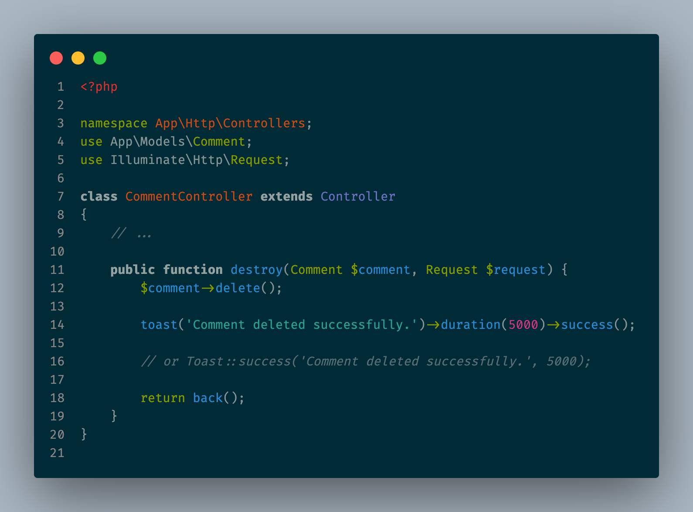
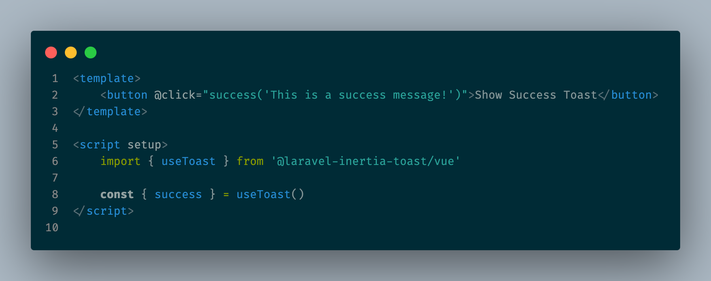

# Laravel Inertia Toast

An opinionated package that provides beautiful toast notifications for Laravel + Inertia.js applications. Fluent PHP API, multi-toast support, redirect-safe, with Vue 3 and React adapters.

Toast notifications can can be triggered from both your backend (PHP) and frontend (JavaScript). Use `Toast::success('Saved!')` in your controllers or `useToast().success('Copied!')` in your components — same beautiful toasts either way.

## Demo
**PHP:**


**React:**


**Vue:**


**See it in action:**


## Features

- Fluent PHP API: `toast('Saved!')->success()` or `Toast::success('Saved!')`
- Vue 3 and React adapters with TypeScript support
- Position-aware with 6 positions (top-right, top-left, top-center, bottom-right, bottom-left, bottom-center)
- Tailwind CSS styling (v3 & v4 compatible)
- Client-side toast API via `useToast()` composable/hook
- Beautiful in/out animations.

## Installation

### 1. PHP Package

```bash
composer require veekthoven/laravel-inertia-toast
```

Optionally publish the config:

```bash
php artisan vendor:publish --tag=inertia-toast-config
```

### 2. Frontend Adapter

**Vue 3:**

```bash
npm install @laravel-inertia-toast/vue
```

**React:**

```bash
npm install @laravel-inertia-toast/react
```

## Setup

### Vue 3

Register the plugin in your `app.js`:

```js
// In your resources/js/app.js

import { createApp } from 'vue'
import { InertiaToast } from '@laravel-inertia-toast/vue'

const app = createApp(App)
app.use(InertiaToast, {
    duration: 5000,
    position: 'top-right',
    maxVisible: 5,
})
app.mount('#app')
```

Add the `<Toasts />` component to your layout:

```vue
<script setup>
import { Toasts } from '@laravel-inertia-toast/vue'
</script>

<template>
  <div>
    <slot />
    <Toasts />
  </div>
</template>
```

### React

Wrap your app with `<ToastProvider>` and add `<Toasts />`:

```jsx
// in your resources/js/app.tsx

import { createRoot } from 'react-dom/client';
import { ToastProvider, Toasts } from '@laravel-inertia-toast/react'

setup({ el, App, props }) {
    const root = createRoot(el);

    root.render(
        <ToastProvider
            config={{
                position: 'top-right'
                duration: 5000,
                maxVisible: 5,
            }}
        >
            <App {...props} />
            <Toasts />
        </ToastProvider>
    );
},
```

### Tailwind CSS

Since the toast components use Tailwind classes internally, you need to add the package to Tailwind's source detection so the required classes are generated.

If you use Tailwind v4, add the following `@source` directive to your main CSS file (e.g. `resources/css/app.css`):

**Vue 3:**

```css
@source "../../node_modules/@laravel-inertia-toast/vue/dist/**/*.js"; 
```


**React:**

```css
@source "../../node_modules/@laravel-inertia-toast/react/dist/**/*.js";
```

> The relative path above assumes your CSS file is at `resources/css/app.css`. Adjust accordingly if your setup differs.

Or if you are still on Tailwind v3, add the following to your `tailwind.config.js` file.


**Vue 3:**
```js
// tailwind.config.js

module.exports = {                                                                                   
    content: [
        //...

        './node_modules/@laravel-inertia-toast/vue/dist/**/*.js',

        //...
    ],
}
```

**React:**
```js
// tailwind.config.js

module.exports = {                                                                                   
    content: [
        //...

        './node_modules/@laravel-inertia-toast/react/dist/**/*.js',
        
        //...
    ],
}
```

> The relative paths above assume your `tailwind.config.js` is at the root of your project. Adjust accordingly if your setup differs.

## Server-Side Usage

### Using the Facade

```php
use InertiaToast\Facades\Toast;

// In a controller
Toast::success('Profile updated!');
Toast::error('Something went wrong.');
Toast::info('Check your email for a confirmation link.');
Toast::warning('Your subscription is about to expire.');

return redirect()->route('dashboard');
```

### Using the Helper

```php
// Fluent builder
toast('Profile updated!')->success();
toast('Something went wrong.')->error();
toast('Slow message.')->duration(10000)->warning();

// Direct access to Toaster
toast()->success('Quick shorthand');
```

### Custom Duration

```php
// Via facade
Toast::success('Saved!', 3000); // 3 seconds

// Via helper
toast('Done!')->duration(3000)->success();
```

## Client-Side Usage

Both adapters expose a `useToast()` composable/hook for triggering toasts from the frontend:

### Vue 3

```vue
<script setup>
import { useToast } from '@laravel-inertia-toast/vue'

const { success, error, info, warning } = useToast()

function handleClick() {
  success('Copied to clipboard!')
}
</script>
```

### React

```jsx
import { useToast } from '@laravel-inertia-toast/react'

function MyComponent() {
  const { success, error, info, warning } = useToast()

  return (
    <button onClick={() => success('Copied to clipboard!')}>
      Copy
    </button>
  )
}
```

## Configuration

Publish the config file:

```bash
php artisan vendor:publish --tag=inertia-toast-config
```

```php
// config/inertia-toast.php
return [
    'duration' => 5000,         // Default auto-dismiss duration (ms)
    'position' => 'top-right',  // Toast position on screen
    'max_visible' => 5,         // Max simultaneous toasts
    'prop_key' => 'toasts',     // Inertia flash key
];
```

Frontend config can be passed when registering the plugin (Vue) or via the `config` prop on `<ToastProvider>` (React).

## Packages

| Package | Description |
|---------|-------------|
| `veekthoven/laravel-inertia-toast` | PHP package — Facade, helper, Inertia flash integration |
| [`@laravel-inertia-toast/vue`](vue) | Vue 3 adapter — Plugin, composable, components |
| [`@laravel-inertia-toast/react`](react) | React adapter — Provider, hook, components |

> **Note:** You can install and use the frontend adapters without the backend package. But to use the backend package, you'd need to install and setup the adapter of the frontend framework you are using. To get the full experience though, use both backend and frontend packages.

## Requirements

- PHP 8.1+
- Laravel 10, 11, or 12
- Inertia.js v2.3.3+
- Vue 3.3+ or React 18+
- Tailwind v3, v4

## License

MIT
