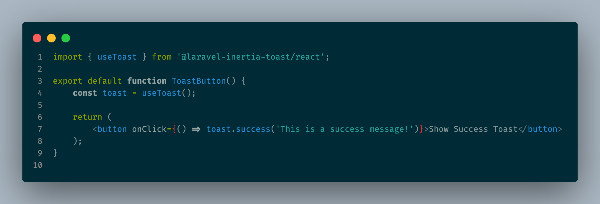
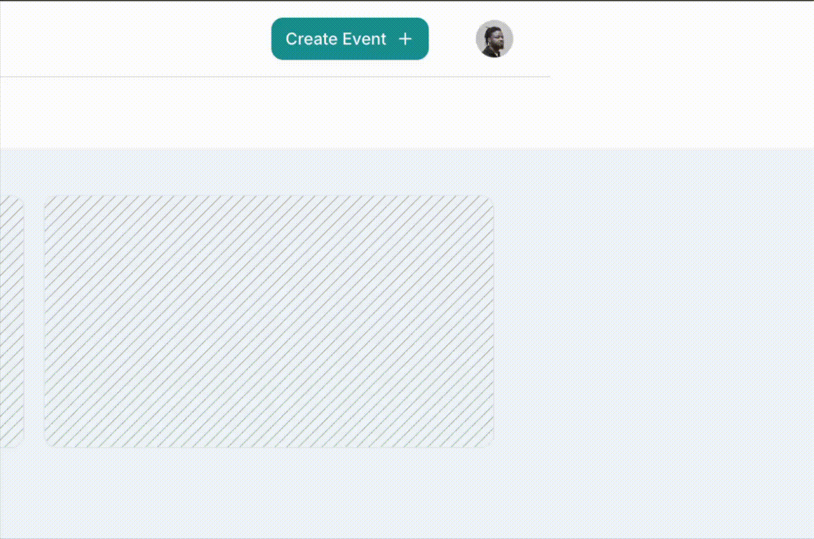

# @laravel-inertia-toast/react

React adapter for [Laravel Inertia Toast](https://github.com/veekthoven/laravel-inertia-toast) — beautiful toast notifications for Laravel + Inertia.js applications.

## Demo

**React:**


**See it in action:**


## Installation

```bash
npm install @laravel-inertia-toast/react
```

## Setup

### 1. Add the Provider

Wrap your app with `<ToastProvider>` and add `<Toasts />`:

```jsx
// in your resources/js/app.tsx

import { createRoot } from 'react-dom/client';
import { ToastProvider, Toasts } from '@laravel-inertia-toast/react'

setup({ el, App, props }) {
    const root = createRoot(el);

    root.render(
        <ToastProvider
            config={{
                position: 'top-right'
                duration: 5000,
                maxVisible: 5,
            }}
        >
            <App {...props} />
            <Toasts />
        </ToastProvider>
    );
},
```

### 2. Tailwind CSS

Since the toast components use Tailwind classes internally, add the package to Tailwind's source detection.

**Tailwind v4** — add this `@source` directive to your CSS file (e.g. `resources/css/app.css`):

```css
@source "../../node_modules/@laravel-inertia-toast/react/dist/**/*.js";
```

**Tailwind v3** — add to `tailwind.config.js`:

```js
module.exports = {
    content: [
        // ...
        './node_modules/@laravel-inertia-toast/react/dist/**/*.js',
    ],
}
```

> The relative paths above assume standard Laravel project structure. Adjust if your setup differs.

## Client-Side Usage

Use the `useToast()` hook to trigger toasts from your components:

```jsx
import { useToast } from '@laravel-inertia-toast/react'

function MyComponent() {
  const { success, error, info, warning } = useToast()

  return (
    <button onClick={() => success('Copied to clipboard!')}>
      Copy
    </button>
  )
}
```

## Server-Side Usage

Pair with the PHP package for server-side toasts:

```bash
composer require veekthoven/laravel-inertia-toast
```

```php
use InertiaToast\Facades\Toast;

Toast::success('Profile updated!');
Toast::error('Something went wrong.');
Toast::info('Check your email for a confirmation link.');
Toast::warning('Your subscription is about to expire.');

return redirect()->route('dashboard');
```

For full documentation, configuration options, and the PHP helper API, see the [main repository](https://github.com/veekthoven/laravel-inertia-toast).

## Requirements

- React 18+
- Inertia.js v2.3.3+
- Tailwind CSS v3 or v4

## License

MIT
